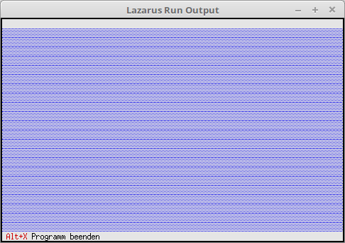

# 02 - Status Line and Menu
## 00 - Status Line



Changing the status line.
The status line is needed to display important information and hotkeys.

---
Various units are needed for the status line.

```pascal
uses
  App,      // TApplication
  Objects,  // Window area (TRect)
  Drivers,  // Hotkey
  Views,    // Event (cmQuit)
  Menus;    // Status line
```

If you want to change something, you have to inherit from TApplication.
In this example, the status line is modified, for this you need to override the **InitStatusLine** procedure.

```pascal
  procedure TMyApp.InitStatusLine;
  var
    R: TRect;           // Rectangle for the status line position.
  begin
    GetExtent(R);       // Returns the size/position of the app, normally 0, 0, 80, 24.
    R.A.Y := R.B.Y - 1; // Position of the status line, set to bottom line of the app.

    StatusLine := New(PStatusLine, Init(R, NewStatusDef(0, $FFFF, NewStatusKey('~Alt+X~ Programm beenden', kbAltX, cmQuit, nil), nil)));
  end;
```

For the new status line to be used, you must declare the descendant instead of **TApplication**.

```pascal
var
  MyApp: TMyApp;
```

The execution remains the same.

```pascal
begin
  MyApp.Init;   // Initialize
  MyApp.Run;    // Process
  MyApp.Done;   // Free
end.
```
