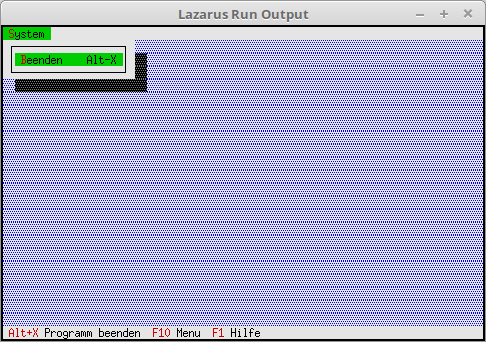

# 02 - Status Line and Menu
## 10 - Menu



Adding a menu.

---
The same units as for the status line are needed for the menu.

```pascal
uses
  App,      // TApplication
  Objects,  // Window area (TRect)
  Drivers,  // Hotkey
  Views,    // Event (cmQuit)
  Menus;    // Status line
```

For a menu you have to inherit **InitMenuBar**.

```pascal
type
  TMyApp = object(TApplication)
    procedure InitStatusLine; virtual;   // Status line
    procedure InitMenuBar; virtual;      // Menu
  end;
```

Create the menu, the example has only one single menu item, Exit.
For the menu, the characters highlighted with **~x~** are not only optical, but also functional.
To exit, you can also press **[Alt+s]**, **[b]**.
There are also direct hotkeys to the menu items, here in the example **[Alt+x]** is for exit.
This accidentally overlaps here with **[Alt+x]** from the status line, but this doesn't matter.
The structure of menu generation is similar to the status line.
The last menu item always has a **nil**.

```pascal
  procedure TMyApp.InitMenuBar;
  var
    R: TRect;           // Rectangle for the menu line position.
  begin
    GetExtent(R);
    R.B.Y := R.A.Y + 1; // Position of the menu, set to top line of the app.

    MenuBar := New(PMenuBar, Init(R, NewMenu(
      NewSubMenu('~D~atei', hcNoContext, NewMenu(
      NewItem('~B~eenden', 'Alt-X', kbAltX, cmQuit, hcNoContext,
      nil)), nil))));
  end;
```
