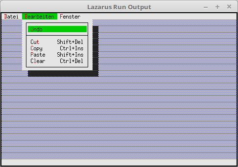

# 02 - Status Line and Menu
## 25 - Ready-made Status Line and Menus



There are ready-made items for the status line and the menu, but I prefer to create the items myself.
The ready-made items are only in English.
The status line is textless, the only thing it brings is quick commands. ( cmQuit, cmMenu, cmClose, cmZoom, cmNext, cmPrev )
Except for **OS shell** and **Exit** nothing happens.

---
With **StdStatusKeys(...** a status line is created, but as described above, you can't see any text.

```pascal
  procedure TMyApp.InitStatusLine;
  var
    R: TRect;
  begin
    GetExtent(R);
    R.A.Y := R.B.Y - 1;

    StatusLine := New(PStatusLine, Init(R, NewStatusDef(0, $FFFF, StdStatusKeys(nil), nil)));
  end;
```

For the menu there are 3 ready-made items, for File, Edit and Window, but again in English.

```pascal
  procedure TMyApp.InitMenuBar;
  var
    R: TRect;
  begin
    GetExtent(R);
    R.B.Y := R.A.Y + 1;

    MenuBar := New(PMenuBar, Init(R, NewMenu(
      NewSubMenu('~D~atei', hcNoContext, NewMenu(
        StdFileMenuItems (nil)),
      NewSubMenu('~B~earbeiten', hcNoContext, NewMenu(
         StdEditMenuItems (nil)),
      NewSubMenu('~F~enster', hcNoContext, NewMenu(
        StdWindowMenuItems(nil)), nil))))));
  end;
```
