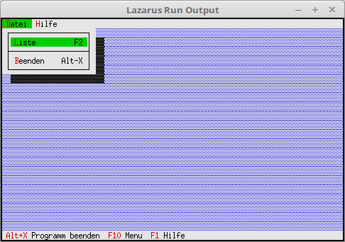

# 03 - Dialogs
## 00 - Process Events



Processing the events of the status line and the menu.

---
Commands that are processed.

```pascal
const
  cmAbout = 1001;     // Show About
  cmList = 1002;      // File List
```

The event handler is also a descendant.

```pascal
type
  TMyApp = object(TApplication)
    procedure InitStatusLine; virtual;                 // Status line
    procedure InitMenuBar; virtual;                    // Menu
    procedure HandleEvent(var Event: TEvent); virtual; // Event handler
  end;
```

Processing of own cmxxx commands.

```pascal
  procedure TMyApp.HandleEvent(var Event: TEvent);
  begin
    inherited HandleEvent(Event);

    if Event.What = evCommand then begin
      case Event.Command of
        cmAbout: begin    // Do something with cmAbout.
        end;
        cmList: begin     // Do something with cmList.
        end;
        else begin
          Exit;
        end;
      end;
    end;
    ClearEvent(Event);
  end;
```
