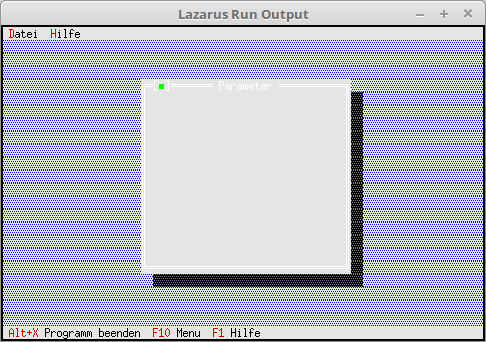

# 03 - Dialogs
## 05 - First Dialog



Processing the events of the status line and the menu.

---
For dialogs you still need to include the **Dialogs** unit.

```pascal
uses
  App,      // TApplication
  Objects,  // Window area (TRect)
  Drivers,  // Hotkey
  Views,    // Event (cmQuit)
  Menus,    // Status line
  Dialogs;  // Dialogs
```

Another command for calling the dialog.

```pascal
const
  cmAbout = 1001;     // Show About
  cmList = 1002;      // File List
  cmPara = 1003;      // Parameter
```

New functions also come into the class.
Here a dialog for parameter input.

```pascal
type
  TMyApp = object(TApplication)
    procedure InitStatusLine; virtual;                 // Status line
    procedure InitMenuBar; virtual;                    // Menu
    procedure HandleEvent(var Event: TEvent); virtual; // Event handler

    procedure MyParameter;                             // new function for a dialog.
  end;
```

The menu is extended by Parameter and Close.

```pascal
  procedure TMyApp.InitMenuBar;
  var
    R: TRect;                          // Rectangle for the menu line position.

    M: PMenu;                          // Whole menu
    SM0, SM1,                          // Submenu
    M0_0, M0_1, M0_2, M0_3, M0_4, M0_5,
    M1_0: PMenuItem;                   // Simple menu items

  begin
    GetExtent(R);
    R.B.Y := R.A.Y + 1;

    M1_0 := NewItem('~A~bout...', '', kbNoKey, cmAbout, hcNoContext, nil);
    SM1 := NewSubMenu('~H~ilfe', hcNoContext, NewMenu(M1_0), nil);

    M0_5 := NewItem('~B~eenden', 'Alt-X', kbAltX, cmQuit, hcNoContext, nil);
    M0_4 := NewLine(M0_5);
    M0_3 := NewItem('S~c~hliessen', 'Alt-F3', kbAltF3, cmClose, hcNoContext, M0_4);
    M0_2 := NewLine(M0_3);
    M0_1 := NewItem('~P~arameter...', '', kbF2, cmPara, hcNoContext, M0_2);
    M0_0 := NewItem('~L~iste', 'F2', kbF2, cmList, hcNoContext, M0_1);
    SM0 := NewSubMenu('~D~atei', hcNoContext, NewMenu(M0_0), SM1);

    M := NewMenu(SM0);

    MenuBar := New(PMenuBar, Init(R, M));
  end;
```

Here a dialog is opened with the **cmPara** command.

```pascal
  procedure TMyApp.HandleEvent(var Event: TEvent);
  begin
    inherited HandleEvent(Event);

    if Event.What = evCommand then begin
      case Event.Command of
        cmAbout: begin
        end;
        cmList: begin
        end;
        cmPara: begin     // Open parameter dialog.
          MyParameter;
        end;
        else begin
          Exit;
        end;
      end;
    end;
    ClearEvent(Event);
  end;
```

Building an empty dialog.
Here too **TRect** is needed for the size.
This is needed for all components, whether button, etc.

```pascal
  procedure TMyApp.MyParameter;
  var
    Dlg: PDialog;
    R: TRect;
  begin
    R.Assign(0, 0, 35, 15);                    // Size of the dialog.
    R.Move(23, 3);                             // Position of the dialog.
    Dlg := New(PDialog, Init(R, 'Parameter')); // Create dialog.
    Desktop^.Insert(Dlg);                      // Assign dialog to the app.
  end;
```
