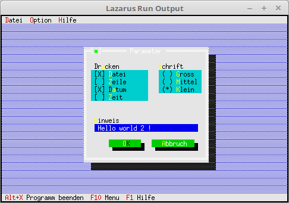

# 03 - Dialogs
## 45 - Save Dialog Values to Disk



So that the values of the dialog are preserved even after closing the application, we save the data to disk.
It is not checked whether writing is possible, etc.
If you want this, you would have to check with **IOResult**, etc.

---
Here **sysutils** is added, it is needed for **FileExists**.

```pascal
uses
  SysUtils, // For file operations
```

The file in which the data for the dialog is located.

```pascal
const
  DialogDatei = 'parameter.cfg';
```

At the beginning, the data is loaded from disk if available, otherwise it is created.

```pascal
  constructor TMyApp.Init;
  begin
    inherited Init;
    // Check if file exists.
    if FileExists(DialogDatei) then begin
      // Load data from disk.
      AssignFile(fParameterData, DialogDatei);
      Reset(fParameterData);
      Read(fParameterData, ParameterData);
      CloseFile(fParameterData);
      // otherwise use default values.
    end else begin
      with ParameterData do begin
        Druck := %0101;
        Schrift := 2;
        Hinweis := 'Hello world !';
      end;
    end;
  end;
```

The data is saved to disk when **Ok** is pressed.

```pascal
  procedure TMyApp.MyParameter;
  var
    Dlg: PDialog;
    R: TRect;
    dummy: word;
    View: PView;
  begin
    R.Assign(0, 0, 35, 15);
    R.Move(23, 3);
    Dlg := New(PDialog, Init(R, 'Parameter'));
    with Dlg^ do begin

      // CheckBoxes
      R.Assign(2, 3, 18, 7);
      View := New(PCheckBoxes, Init(R,
        NewSItem('~D~atei',
        NewSItem('~Z~eile',
        NewSItem('D~a~tum',
        NewSItem('~Z~eit',
        nil))))));
      Insert(View);
      // Label for CheckGroup.
      R.Assign(2, 2, 10, 3);
      Insert(New(PLabel, Init(R, 'Dr~u~cken', View)));

      // RadioButtons
      R.Assign(21, 3, 33, 6);
      View := New(PRadioButtons, Init(R,
        NewSItem('~G~ross',
        NewSItem('~M~ittel',
        NewSItem('~K~lein',
        nil)))));
      Insert(View);
      // Label for RadioGroup.
      R.Assign(20, 2, 31, 3);
      Insert(New(PLabel, Init(R, '~S~chrift', View)));

      // Edit Line
      R.Assign(3, 10, 32, 11);
      View := New(PInputLine, Init(R, 50));
      Insert(View);
      // Label for Edit Line
      R.Assign(2, 9, 10, 10);
      Insert(New(PLabel, Init(R, '~H~inweis', View)));

      // Ok-Button
      R.Assign(7, 12, 17, 14);
      Insert(new(PButton, Init(R, '~O~K', cmOK, bfDefault)));

      // Close-Button
      R.Assign(19, 12, 32, 14);
      Insert(new(PButton, Init(R, '~A~bbruch', cmCancel, bfNormal)));
    end;
    if ValidView(Dlg) <> nil then begin // Check if enough memory.
      Dlg^.SetData(ParameterData);      // Load dialog with the values.
      dummy := Desktop^.ExecView(Dlg);  // Execute dialog.
      if dummy = cmOK then begin        // If dialog ended with Ok, then load data from dialog to record.
        Dlg^.GetData(ParameterData);

        // Save data to disk.
        AssignFile(fParameterData, DialogDatei);
        Rewrite(fParameterData);
        Write(fParameterData, ParameterData);
        CloseFile(fParameterData);
      end;

      Dispose(Dlg, Done);               // Free dialog and memory.
    end;
  end;
```
