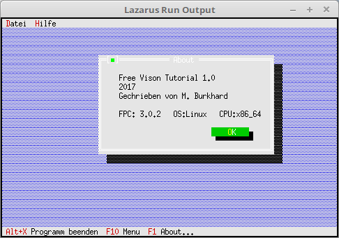

# 04 - Dialogs as Components
## 00 - A Simple About



If you need the same dialog again and again, it's best to pack it as a component in a unit.
For this you write a descendant of **TDialog**.
An about dialog is built here as an example.

---
Here the about dialog is loaded and then freed on close.

```pascal
  procedure TMyApp.HandleEvent(var Event: TEvent);
  var
    AboutDialog: PMyAbout;
  begin
    inherited HandleEvent(Event);

    if Event.What = evCommand then begin
      case Event.Command of
        cmAbout: begin
          AboutDialog := New(PMyAbout, Init);         // Create new dialog.
          if ValidView(AboutDialog) <> nil then begin // Check if enough memory.
            Desktop^.ExecView(AboutDialog);           // Execute About dialog.
            Dispose(AboutDialog, Done);               // Free dialog and memory.
          end;
        end;
        else begin
          Exit;
        end;
      end;
    end;
    ClearEvent(Event);
  end;
```


---
**Unit with the new dialog.**

```pascal
unit MyDialog;

```

A new constructor must be created for the dialog.
Another note about StaticText, if you want to insert a blank line, you have to write **#13#32#13**, with **#13#13** only a simple line break is executed.

```pascal
interface

uses
  App, Objects, Drivers, Views, Dialogs;

type
  PMyAbout = ^TMyAbout;
  TMyAbout = object(TDialog)
    constructor Init;  // New constructor, which builds the dialog with the components.
  end;

```

The dialog components are created in the constructor.

```pascal
implementation

constructor TMyAbout.Init;
var
  R: TRect;
begin
  R.Assign(0, 0, 42, 11);
  R.Move(23, 3);

  inherited Init(R, 'About');  // Create dialog in predefined size.

  // StaticText
  R.Assign(5, 2, 41, 8);
  Insert(new(PStaticText, Init(R,
    'Free Vison Tutorial 1.0' + #13 +
    '2017' + #13 +
    'Written by M. Burkhard' + #13#32#13 +
    'FPC: '+ {$I %FPCVERSION%} + '   OS:'+ {$I %FPCTARGETOS%} + '   CPU:' + {$I %FPCTARGETCPU%})));

  // Ok-Button
  R.Assign(27, 8, 37, 10);
  Insert(new(PButton, Init(R, '~O~K', cmOK, bfDefault)));
end;

```
