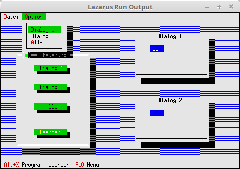

# 04 - Dialogs as Components
## 20 - Pass Event to Dialog



In this example it is shown how to send an event to another component.
In this case, an event is sent to the dialogs. In the dialogs, a counter is then incremented.
Events for the button click.

```pascal
const
  cmDia1   = 1001;
  cmDia2   = 1002;
  cmDiaAll = 1003;
```

Here the 2 passive output dialogs are created, these are located in the object TMyDialog.
Additionally, a dialog is created which receives 3 buttons, which then send the commands to the other dialogs.

```pascal
  constructor TMyApp.Init;
  var
    R: TRect;
    Dia: PDialog;
  begin
    inherited init;

    // first passive dialog
    R.Assign(45, 2, 70, 9);
    Dialog1 := New(PMyDialog, Init(R, 'Dialog 1'));
    Dialog1^.SetState(sfDisabled, True);    // Set dialog to ReadOnly.
    if ValidView(Dialog1) <> nil then begin // Check if enough memory.
      Desktop^.Insert(Dialog1);
    end;

    // second passive dialog
    R.Assign(45, 12, 70, 19);
    Dialog2 := New(PMyDialog, Init(R, 'Dialog 2'));
    Dialog2^.SetState(sfDisabled, True);
    if ValidView(Dialog2) <> nil then begin
      Desktop^.Insert(Dialog2);
    end;

    // Control dialog
    R.Assign(5, 5, 30, 20);
    Dia := New(PDialog, Init(R, 'Steuerung'));

    with Dia^ do begin
      R.Assign(6, 2, 18, 4);
      Insert(new(PButton, Init(R, 'Dialog ~1~', cmDia1, bfNormal)));

      R.Move(0, 3);
      Insert(new(PButton, Init(R, 'Dialog ~2~', cmDia2, bfNormal)));

      R.Move(0, 3);
      Insert(new(PButton, Init(R, '~A~lle', cmDiaAll, bfNormal)));

      R.Move(0, 4);
      Insert(new(PButton, Init(R, '~B~eenden', cmQuit, bfNormal)));
    end;

    if ValidView(Dia) <> nil then begin
      Desktop^.Insert(Dia);
    end;
  end;
```

Here the commands are sent to the dialogs with **Message**.
If you specify the view of the dialog as the first parameter, only this dialog is addressed.
If you specify **@Self**, the commands are sent to all dialogs.
For the 4th parameter, you can also pass a pointer to a label,
this can be e.g. a string or a record, etc.

```pascal
  procedure TMyApp.HandleEvent(var Event: TEvent);
  begin
    inherited HandleEvent(Event);

    if Event.What = evCommand then begin
      case Event.Command of
        cmDia1: begin
          Message(Dialog1, evBroadcast, cmCounterUp, nil); // Command Dialog 1
        end;
        cmDia2: begin
          Message(Dialog2, evBroadcast, cmCounterUp, nil); // Command Dialog 2
        end;
        cmDiaAll: begin
          Message(@Self, evBroadcast, cmCounterUp, nil);   // Command to all dialogs
        end;
        else begin
          Exit;
        end;
      end;
    end;
    ClearEvent(Event);
  end;
```


---
**Unit with the new dialog.**
<br>
The dialog with the counter output.

```pascal
unit MyDialog;

```

Declaration of the object of the passive dialogs.

```pascal
type
  PMyDialog = ^TMyDialog;
  TMyDialog = object(TDialog)
  var
    CounterInputLine: PInputLine; // Output line for the counter.

    constructor Init(var Bounds: TRect; ATitle: TTitleStr);
    procedure HandleEvent(var Event: TEvent); virtual;
  end;

```

In the constructor, an output line is created.

```pascal
constructor TMyDialog.Init(var Bounds: TRect; ATitle: TTitleStr);
var
  R: TRect;
begin
  inherited Init(Bounds, ATitle);

  R.Assign(5, 2, 10, 3);
  CounterInputLine := new(PInputLine, Init(R, 20));
  CounterInputLine^.Data^ := '0';
  Insert(CounterInputLine);
end;

```

In the event handler, the command sent with **Message** is received.
As proof of this, the number in the output line is incremented by one.

```pascal
procedure TMyDialog.HandleEvent(var Event: TEvent);
var
  Counter: integer;
begin
  inherited HandleEvent(Event);

  case Event.What of
    evBroadcast: begin
      case Event.Command of
        cmCounterUp: begin                              // cmCounterUp was sent with Message.
          Counter := StrToInt(CounterInputLine^.Data^); // Read output line.
          Inc(Counter);                                 // Increase counter.
          CounterInputLine^.Data^ := IntToStr(Counter); // Output new number.
          CounterInputLine^.Draw;                       // Update output line.
        end;
      end;
    end;
  end;

end;

```
