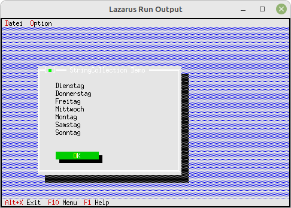

# 06 - Lists and ListBoxen
## 05 - StringCollection Sorted



A sorted string list
for a sorted list you must use **PStringCollection** or **PStrCollection**.

---

---
**Unit with the new dialog.**
<br>
The dialog with the **StringCollection**
Declaration of the dialog, nothing special.

```pascal
type
  PMyDialog = ^TMyDialog;
  TMyDialog = object(TDialog)
    constructor Init;
  end;

```

A **StringCollection** is built and
as a demonstration its content is written to a StaticText.
You can clearly see that the days of the week are sorted alphabetically.

```pascal
constructor TMyDialog.Init;
var
  R: TRect;
  s: shortstring;
  i: Integer;
  StringCollection: PStringCollection;

const
  Tage: array [0..6] of shortstring = (
  'Montag', 'Dienstag', 'Mittwoch', 'Donnerstag', 'Freitag', 'Samstag', 'Sonntag');

begin
  R.Assign(10, 5, 50, 19);
  inherited Init(R, 'StringCollection Demo');

  // StringCollection
  StringCollection := new(PStringCollection, Init(5, 5));
  for i := 0 to Length(Tage) - 1 do begin
    StringCollection^.Insert(NewStr(Tage[i]));
  end;
  s := '';

  for i := 0 to StringCollection^.Count - 1 do begin
    s := s + PString(StringCollection^.At(i))^ + #13;
  end;

  Dispose(StringCollection, Done); // Free the list

  R.Assign(5, 2, 36, 12);
  Insert(new(PStaticText, Init(R, s)));

  // Ok-Button
  R.Assign(5, 11, 18, 13);
  Insert(new(PButton, Init(R, '~O~K', cmOK, bfDefault)));
end;

```
