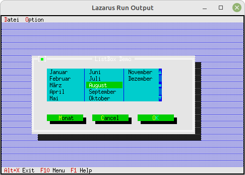

# 06 - Lists and ListBoxen
## 20 - ListBox Multiple Columns



The **ListBox** can also have multiple columns.

---

---
**Unit with the new dialog.**
<br>
The dialog with the multi-column ListBox

```pascal
unit MyDialog;

```

Declare the **destructor** which frees the **memory** of the list.

```pascal
type
  PMyDialog = ^TMyDialog;
  TMyDialog = object(TDialog)
    ListBox: PListBox;
    StringCollection: PUnSortedStrCollection;

    constructor Init;
    destructor Done; virtual;  // Because of memory leak in TList
    procedure HandleEvent(var Event: TEvent); virtual;
  end;

```

Generate components for the dialog.
The second parameter at Init of **TListBox** specifies the number of columns.
In this example it is 3.

```pascal
const
  cmMonat = 1000;  // Local event constant

constructor TMyDialog.Init;
var
  R: TRect;
  ScrollBar: PScrollBar;
  i: integer;
const
  Tage: array [0..11] of shortstring = (
    'Januar', 'Februar', 'M' + #132'rz', 'April', 'Mai', 'Juni', 'Juli',
    'August', 'September', 'Oktober', 'November', 'Dezember');

begin
  R.Assign(10, 5, 64, 17);
  inherited Init(R, 'ListBox Demo');

  // StringCollection
  StringCollection := new(PUnSortedStrCollection, Init(5, 5));
  for i := 0 to Length(Tage) - 1 do begin
    StringCollection^.Insert(NewStr(Tage[i]));
  end;

  // ScrollBar for ListBox
  R.Assign(42, 2, 43, 7);
  ScrollBar := new(PScrollBar, Init(R));
  Insert(ScrollBar);

  // ListBox
  R.A.X := 5;
  Dec(R.B.X, 1);
  ListBox := new(PListBox, Init(R, 3, ScrollBar)); // 3 columns
  ListBox^.NewList(StringCollection);
  Insert(ListBox);

  // Month-Button
  R.Assign(5, 9, 18, 11);
  Insert(new(PButton, Init(R, '~M~onat', cmMonat, bfNormal)));

  // Cancel-Button
  R.Move(15, 0);
  Insert(new(PButton, Init(R, '~C~ancel', cmCancel, bfNormal)));

  // Ok-Button
  R.Move(15, 0);
  Insert(new(PButton, Init(R, '~O~K', cmOK, bfDefault)));
end;

```

Manually free the memory of the list.

```pascal
destructor TMyDialog.Done;
begin
  Dispose(ListBox^.List, Done); // Free the list
  inherited Done;
end;

```

The event handler
When you click on **[Month]**, the focused entry of the ListBox is displayed.

```pascal
procedure TMyDialog.HandleEvent(var Event: TEvent);
begin
  case Event.What of
    evCommand: begin
      case Event.Command of
        cmOK: begin
          // do something
        end;
        cmMonat: begin
          // Read focused entry
          // And output
          MessageBox('Monat: ' + PString(ListBox^.GetFocusedItem)^ + ' selected', nil, mfOKButton);
          // End event.
          ClearEvent(Event);
        end;
      end;
    end;
  end;
  inherited HandleEvent(Event);
end;

```
