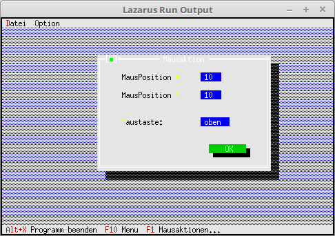

# 08 - EventHandle outside Components
## 00 - Mouse Event



You can intercept an event handler in the dialog/window when you move/click the mouse.
There is nothing special for this in the main program, all this runs locally in the dialog/window.

---
In the main program, only the dialog is built, called and closed.

```pascal
  procedure TMyApp.HandleEvent(var Event: TEvent);
  var
    MouseDialog: PMyMouse;
  begin
    inherited HandleEvent(Event);

    if Event.What = evCommand then begin
      case Event.Command of
        cmMouseAktion: begin
          MouseDialog := New(PMyMouse, Init);
          if ValidView(MouseDialog) <> nil then begin // Check if enough memory.
            Desktop^.ExecView(MouseDialog);           // Execute mouse action dialog.
            Dispose(MouseDialog, Done);               // Free dialog and memory.
          end;
        end;
        else begin
          Exit;
        end;
      end;
    end;
    ClearEvent(Event);
  end;
```


---
**Unit with the mouse action dialog.**
<br>

```pascal
unit MyDialog;

```

In the object, the **PEditLine** are declared globally, as they will be modified later on mouse actions.

```pascal
type
  PMyMouse = ^TMyMouse;
  TMyMouse = object(TDialog)
    EditMB,
    EditX, EditY: PInputLine;

    constructor Init;
    procedure HandleEvent(var Event: TEvent); virtual;
  end;

```

A dialog with EditLine, Label and Button is built.
The only special thing there is that the **EditLine** status is set to **ReadOnly**, own entries are unwanted there.

```pascal
constructor TMyMouse.Init;
var
  R: TRect;
begin
  R.Assign(0, 0, 42, 13);
  R.Move(23, 3);
  inherited Init(R, 'Mausaktion');

  // PosX
  R.Assign(25, 2, 30, 3);
  EditX := new(PInputLine, Init(R, 5));
  Insert(EditX);
  EditX^.State := sfDisabled or EditX^.State;    // ReadOnly
  R.Assign(5, 2, 20, 3);
  Insert(New(PLabel, Init(R, 'Mouse Position ~X~:', EditX)));

  // PosY
  R.Assign(25, 4, 30, 5);
  EditY := new(PInputLine, Init(R, 5));
  EditY^.State := sfDisabled or EditY^.State;    // ReadOnly
  Insert(EditY);
  R.Assign(5, 4, 20, 5);
  Insert(New(PLabel, Init(R, 'Mouse Position ~Y~:', EditY)));

  // Mouse buttons
  R.Assign(25, 7, 32, 8);
  EditMB := new(PInputLine, Init(R, 7));
  EditMB^.State := sfDisabled or EditMB^.State;  // ReadOnly
  EditMB^.Data^:= 'up';                          // Initially the button is up.
  Insert(EditMB);
  R.Assign(5, 7, 20, 8);
  Insert(New(PLabel, Init(R, '~M~ouse button:', EditMB)));

  // Ok-Button
  R.Assign(27, 10, 37, 12);
  Insert(new(PButton, Init(R, '~O~K', cmOK, bfDefault)));
end;

```

In the event handler you can clearly see that the mouse actions are intercepted there.
The mouse data is output to the **EditLines**.

```pascal
procedure TMyMouse.HandleEvent(var Event: TEvent);
var
  Mouse : TPoint;
begin
  inherited HandleEvent(Event);

  case Event.What of
    evMouseDown: begin                 // Button was pressed.
      EditMB^.Data^:= 'down';
      EditMB^.Draw;
    end;
    evMouseUp: begin                   // Button was released.
      EditMB^.Data^:= 'up';
      EditMB^.Draw;
    end;
    evMouseMove: begin                 // Mouse was moved.
      MakeLocal (Event.Where, Mouse);  // Determine mouse position.
      EditX^.Data^:= IntToStr(Mouse.X);
      EditX^.Draw;
      EditY^.Data^:= IntToStr(Mouse.Y);
      EditY^.Draw;
    end;
  end;

end;

```
