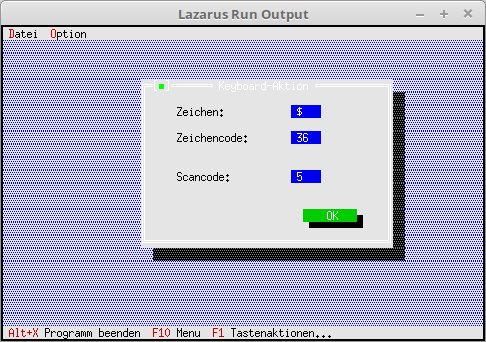

# 08 - EventHandle outside Components
## 05 - Keyboard Event



You can intercept an event handler in the dialog/window when you move/click the mouse.
In the main program there is nothing special for this, all this runs locally in the dialog/window.

---
In the main program, only the dialog is built, called and closed.

```pascal
  procedure TMyApp.HandleEvent(var Event: TEvent);
  var
    KeyDialog: PMyKey;
  begin
    inherited HandleEvent(Event);

    if Event.What = evCommand then begin
      case Event.Command of
        cmKeyAktion: begin
          KeyDialog := New(PMyKey, Init);
          if ValidView(KeyDialog) <> nil then begin // Check if enough memory.
            Desktop^.ExecView(KeyDialog);           // Execute keyboard action dialog.
            Dispose(KeyDialog, Done);               // Free dialog and memory.
          end;
        end;
        else begin
          Exit;
        end;
      end;
    end;
    ClearEvent(Event);
  end;
```


---
**Unit with the keyboard action dialog.**
<br>

```pascal
unit MyDialog;

```

In the object, the **PEditLine** are declared globally, as they will be modified later on keyboard actions.

```pascal
type
  PMyKey = ^TMyKey;
  TMyKey = object(TDialog)
    EditScanCode, EditShiftState,
    EditZeichen, EditZeichenCode: PInputLine;

    constructor Init;
    procedure HandleEvent(var Event: TEvent); virtual;
  end;

```

A dialog with EditLine, Label and Button is built.
The only special thing there is that the **EditLine** status is set to **ReadOnly**, own entries are unwanted there.

```pascal
constructor TMyKey.Init;
var
  R: TRect;
begin
  R.Assign(0, 0, 42, 15);
  R.Move(23, 3);
  inherited Init(R, 'Keyboard-Aktion');

  // PosX
  R.Assign(25, 2, 30, 3);
  EditZeichen := new(PInputLine, Init(R, 5));
  Insert(EditZeichen);
  EditZeichen^.State := sfDisabled or EditZeichen^.State;    // ReadOnly
  R.Assign(5, 2, 20, 3);
  Insert(New(PLabel, Init(R, 'Character:', EditZeichen)));

  // PosY
  R.Assign(25, 4, 30, 5);
  EditZeichenCode := new(PInputLine, Init(R, 5));
  EditZeichenCode^.State := sfDisabled or EditZeichenCode^.State;    // ReadOnly
  Insert(EditZeichenCode);
  R.Assign(5, 4, 20, 5);
  Insert(New(PLabel, Init(R, 'Character code:', EditZeichenCode)));

  // Mouse buttons
  R.Assign(25, 7, 30, 8);
  EditScanCode := new(PInputLine, Init(R, 7));
  EditScanCode^.State := sfDisabled or EditScanCode^.State;  // ReadOnly
  Insert(EditScanCode);
  R.Assign(5, 7, 20, 8);
  Insert(New(PLabel, Init(R, 'Scancode:', EditScanCode)));

  // Mouse buttons
  R.Assign(25, 9, 30, 10);
  EditShiftState := new(PInputLine, Init(R, 7));
  EditShiftState^.State := sfDisabled or EditShiftState^.State;  // ReadOnly
  Insert(EditShiftState);
  R.Assign(5, 9, 20, 10);
  Insert(New(PLabel, Init(R, 'Shiftstate:', EditShiftState)));

  // Ok-Button
  R.Assign(27, 12, 37, 14);
  Insert(new(PButton, Init(R, 'OK', cmOK, bfDefault)));
end;

```

In the event handler you can see that the keyboard is intercepted. The character code and the scancode are output.
In the bottom line a 3 appears when the Shift key is pressed with certain other keys e.g. arrow keys.
The keyboard data is output to the **EditLines**.

```pascal
procedure TMyKey.HandleEvent(var Event: TEvent);
begin
  inherited HandleEvent(Event);

  case Event.What of
    evKeyDown: begin                 // Key was pressed.
      EditZeichen^.Data^:= Event.CharCode;
      EditZeichen^.Draw;
      EditZeichenCode^.Data^:= IntToStr(Byte(Event.CharCode));
      EditZeichenCode^.Draw;
      EditScanCode^.Data^:= IntToStr(Event.ScanCode);
      EditScanCode^.Draw;
      EditShiftState^.Data^:= IntToStr(Event.KeyShift);
      EditShiftState^.Draw;
    end;
  end;

end;

```
