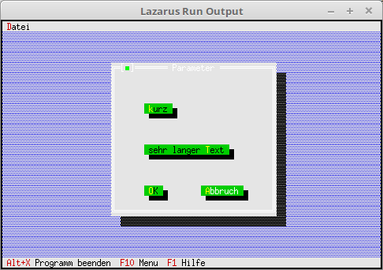

# 10 - Modify Components
## 00 - Modify Button



You can also modify a component, in this example it is a button.
For this you have to create a descendant of TButton.
The modified button automatically adjusts to the length of the title, and it is automatically 2 lines high.

---
Instead of the normal button I now take PMyButton.
You can also see that instead of Rect, only X and Y are specified.

```pascal
  procedure TMyApp.MyParameter;
  var
    Dia: PDialog;
    R: TRect;
  begin
    R.Assign(0, 0, 35, 15);                    // Size of the dialog.
    R.Move(23, 3);                             // Position of the dialog.
    Dia := New(PDialog, Init(R, 'Parameter')); // Create dialog.
    with Dia^ do begin
      // top
      Insert(new(PMyButton, Init(7, 8, 'sehr langer ~T~ext', cmValid, bfDefault)));

      // middle
      Insert(new(PMyButton, Init(7, 4, '~k~urz', cmValid, bfDefault)));

      // Ok-Button
      Insert(new(PMyButton, Init(7, 12, '~O~K', cmOK, bfDefault)));

      // Close-Button
      Insert(new(PMyButton, Init(19, 12, '~A~bbruch', cmCancel, bfNormal)));
    end;
    Desktop^.ExecView(Dia);   // Open dialog modally.
    Dispose(Dia, Done);       // Free dialog and memory.
  end;
```


---
**Unit with the new button.**
<br>
Here it is shown how to modify a button.

```pascal
unit MyButton;

```

Declaration of the new button.
Here you can see that you have to override the constructor.

```pascal
type
  PMyButton = ^TMyButton;
  TMyButton = object(TButton)
    constructor Init(x, y: integer; ATitle: TTitleStr; ACommand: word; AFlags: word);
  end;

```

In the constructor you can see that a **Rect** is generated from **X** and **Y**.
**StringReplace** also removes the ~, as otherwise they would falsify the length of the string.

```pascal
constructor TMyButton.Init(x, y: integer; ATitle: TTitleStr; ACommand: word; AFlags: word);
var
  R: TRect;
begin
  R.Assign(x, y, x + Length(StringReplace(ATitle, '~', '', [])) + 2, y + 2);

  inherited Init(R, ATitle, ACommand, AFlags);
end;

```
