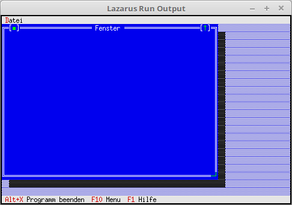

# 11 - Windows
## 00 - First Window



First memo window.

---
The constructor is inherited, so that a new window is created from the start.

```pascal
type
  TMyApp = object(TApplication)
    constructor Init;

    procedure InitStatusLine; virtual;
    procedure InitMenuBar; virtual;

    procedure NewWindows;
  end;
```


```pascal
  constructor TMyApp.Init;
  begin
    inherited Init;   // Call ancestor.
    NewWindows;       // Create window.
  end;
```

Create new window. Windows are usually not opened modally, as you usually want to open several of them.

```pascal
  procedure TMyApp.NewWindows;
  var
    Win: PWindow;
    R: TRect;
  begin
    R.Assign(0, 0, 60, 20);
    Win := New(PWindow, Init(R, 'Fenster', wnNoNumber));
    if ValidView(Win) <> nil then begin
      Desktop^.Insert(Win);
    end;
  end;
```
