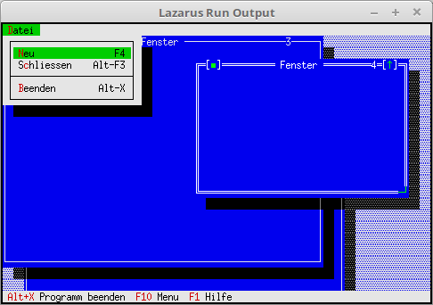

# 11 - Windows
## 05 - Create and Close Window



Create and close windows via the menu.

---
New constants for commands.
The HandleEvent has also been added.

```pascal
const
  cmNewWin = 1001;
type
  TMyApp = object(TApplication)
    constructor Init;

    procedure InitStatusLine; virtual;
    procedure InitMenuBar; virtual;

    procedure HandleEvent(var Event: TEvent); virtual; // Processing commands
    procedure OutOfMemory; virtual;                    // Called when memory overflows.

    procedure NewWindows;
  end;
```

The menu was extended by **New** and **Close**.

```pascal
  procedure TMyApp.InitMenuBar;
  var
    R: TRect;
  begin
    GetExtent(R);
    R.B.Y := R.A.Y + 1;

    MenuBar := New(PMenuBar, Init(R, NewMenu(
      NewSubMenu('~D~atei', hcNoContext, NewMenu(
      NewItem('~N~eu', 'F4', kbF4, cmNewWin, hcNoContext,
      NewItem('S~c~hliessen', 'Alt-F3', kbAltF3, cmClose, hcNoContext,
      NewLine(
      NewItem('~B~eenden', 'Alt-X', kbAltX, cmQuit, hcNoContext, nil))))), nil))));
  end;
```

A counter has been added when creating the window.
This is used to number the windows.

```pascal
  procedure TMyApp.NewWindows;
  var
    Win: PWindow;
    R: TRect;
  const
    WinCounter: integer = 0;      // Counts windows
  begin
    R.Assign(0, 0, 60, 20);
    Inc(WinCounter);
    Win := New(PWindow, Init(R, 'Fenster', WinCounter));
    // If too little memory for window, then counter -1 again.
    if ValidView(Win) <> nil then begin
      Desktop^.Insert(Win);
    end else begin
      Dec(WinCounter);
    end;
  end;
```

**cmNewWin** must be processed yourself. **cmClose** for closing the window runs automatically in the background.

```pascal
  procedure TMyApp.HandleEvent(var Event: TEvent);
  begin
    inherited HandleEvent(Event);

    if Event.What = evCommand then begin
      case Event.Command of
        cmNewWin: begin
          NewWindows;    // Create window.
        end;
        else begin
          Exit;
        end;
      end;
    end;
    ClearEvent(Event);
  end;
```
