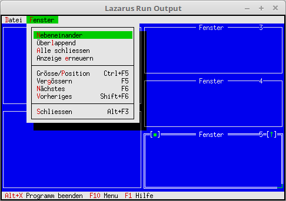

# 11 - Windows
## 10 - Manage Windows



Manage windows. Now it is possible to give control commands for window management via the menu.
E.g. Zoom, minimize, window change, cascade, etc.

---
The menu was extended by the control commands for window management.
The bracketed commands must be done manually.

```pascal
  procedure TMyApp.InitMenuBar;
  var
    R: TRect;
  begin
    GetExtent(R);
    R.B.Y := R.A.Y + 1;

    MenuBar := New(PMenuBar, Init(R, NewMenu(
      NewSubMenu('~D~atei', hcNoContext, NewMenu(
        NewItem('~N~eu', 'F4', kbF4, cmNewWin, hcNoContext,
        NewLine(
        NewItem('~B~eenden', 'Alt-X', kbAltX, cmQuit, hcNoContext, nil)))),
      NewSubMenu('~F~enster', hcNoContext, NewMenu(
        NewItem('~N~ebeneinander', '', kbNoKey, cmTile, hcNoContext,
        NewItem(#154'ber~l~append', '', kbNoKey, cmCascade, hcNoContext,
        NewItem('~A~lle schliessen', '', kbNoKey, cmCloseAll, hcNoContext,
        NewItem('Anzeige ~e~rneuern', '', kbNoKey, cmRefresh, hcNoContext,
        NewLine(
        NewItem('Gr'#148'sse/~P~osition', 'Ctrl+F5', kbCtrlF5, cmResize, hcNoContext,
        NewItem('Ver~g~'#148'ssern', 'F5', kbF5, cmZoom, hcNoContext,
        NewItem('~N~'#132'chstes', 'F6', kbF6, cmNext, hcNoContext,
        NewItem('~V~orheriges', 'Shift+F6', kbShiftF6, cmPrev, hcNoContext,
        NewLine(
        NewItem('~S~chliessen', 'Alt+F3', kbAltF3, cmClose, hcNoContext, Nil)))))))))))), nil)))));

  end;
```

A counter has been added when creating the window.
If you want an overlapping or side-by-side display for the windows, you have to set the status **ofTileable**.

```pascal
  procedure TMyApp.NewWindows;
  var
    Win: PWindow;
    R: TRect;
  const
    WinCounter: integer = 0;                    // Counts windows
  begin
    R.Assign(0, 0, 60, 20);
    Inc(WinCounter);
    Win := New(PWindow, Init(R, 'Fenster', WinCounter));
    Win^.Options := Win^.Options or ofTileable; // For Tile and Cascade

    if ValidView(Win) <> nil then begin
      Desktop^.Insert(Win);
    end else begin
      Dec(WinCounter);
    end;
  end;
```

This procedure closes all windows in the desktop.
For this, every window is sent a **cmClose** event with **ForEach**.

```pascal
  procedure TMyApp.CloseAll;

    procedure SendClose(P: PView);
    begin
      Message(P, evCommand, cmClose, nil);
    end;

  begin
    Desktop^.ForEach(@SendClose);
  end;
```

**cmNewWin** must be processed yourself. **cmClose** for closing the window runs automatically in the background.

```pascal

  procedure TMyApp.HandleEvent(var Event: TEvent);
  begin
    inherited HandleEvent(Event);

    if Event.What = evCommand then begin
      case Event.Command of
        cmNewWin: begin
          NewWindows;    // Create window.
        end;
        cmCloseAll:begin
          CloseAll;      // Closes all windows.
        end;
        cmRefresh: begin
          ReDraw;        // Redraw application.
        end;
        else begin
          Exit;
        end;
      end;
    end;
    ClearEvent(Event);
  end;
```
