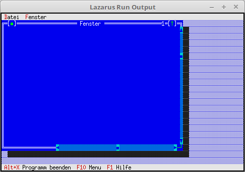

# 11 - Windows
## 15 - Equip Window with Controls



The window was given scrollbars.
You could also add an indicator that shows lines and columns.
And the most important thing for an editor, a memo in which you can write.

If you want to write an editor, you use **PEditWindow** from the **Editors** unit.
This is much easier than building everything yourself.

---
Here the new inherited window is created.

```pascal
  procedure TMyApp.NewWindows;
  var
    Win: PMyWindow;
    R: TRect;
  const
    WinCounter: integer = 0;      // Counts windows
  begin
    R.Assign(0, 0, 60, 20);
    Inc(WinCounter);
    Win := New(PMyWindow, Init(R, 'Fenster', WinCounter));

    if ValidView(Win) <> nil then begin
      Desktop^.Insert(Win);
    end else begin
      Dec(WinCounter);
    end;
  end;
```


---
**Unit with the new window.**
<br>

```pascal
unit MyWindow;

```

Insert a horizontal and a vertical scrollbar.
It is also shown how to set the position of the slider.
With **Min** and **Max** you set the range and with **Value** you specify the position of the slider.
An indicator is also added, which shows the columns and lines. (With a 64Bit OS this is faulty.)

```pascal
constructor TMyWindow.Init(var Bounds: TRect; ATitle: TTitleStr; ANumber: Sw_Integer);
var
  VScrollBar, HScrollBar : PScrollBar;  // Scrollbars
  Indicator  : PIndicator;              // Lines/Columns display
  R: TRect;
begin
  inherited Init(Bounds, ATitle, ANumber);
  Options := Options or ofTileable;     // For Tile and Cascade

  R.Assign (18, Size.Y - 1, Size.X - 2, Size.Y);
  HScrollBar := New (PScrollBar, Init (R));
  HScrollBar^.Max := 100;
  HScrollBar^.Min := 0;
  HScrollBar^.Value := 50;
  Insert (HScrollBar);

  R.Assign (Size.X - 1, 1, Size.X, Size.Y - 1);
  VScrollBar := New (PScrollBar, Init (R));
  VScrollBar^.Max := 100;
  VScrollBar^.Min := 0;
  VScrollBar^.Value := 20;
  Insert (VScrollBar);

  R.Assign (2, Size.Y - 1, 16, Size.Y);
  Indicator := New (PIndicator, Init (R));
  Insert (Indicator);
end;

```
