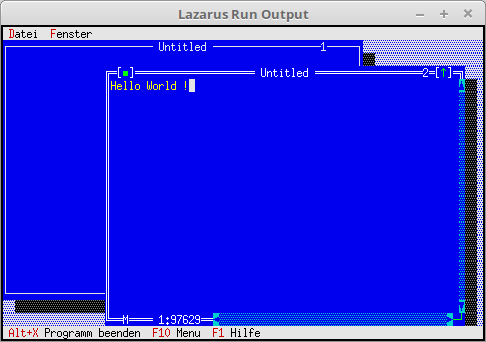

# 12 - Editor
## 00 - Simple Editor Window



The window is now a text editor, to achieve this function you use a **PEditWindow**.
The management of the windows is the same as with a **TWindow**.

---
Insert an empty editor window.

```pascal
  procedure TMyApp.NewWindows;
  var
    Win: PEditWindow;
    R: TRect;
  const
    WinCounter: integer = 0;      // Counts windows
  begin
    R.Assign(0, 0, 60, 20);
    Inc(WinCounter);
    Win := New(PEditWindow, Init(R, '', WinCounter));

    if ValidView(Win) <> nil then begin
      Desktop^.Insert(Win);
    end else begin                // Insert the window.
      Dec(WinCounter);
    end;
  end;
```
