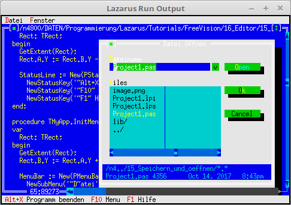

# 12 - Editor
## 05 - Save and Open



An editor only becomes useful when file functions are added, e.g. open and save.
Opening is similar to creating an empty window.
The only difference is that you also specify a filename, which is determined with a FileDialog.
For simple saving, you don't have to do much. You just have to call the **cmSave** event, e.g. via the menu.

---
Here OpenWindows and SaveAll have been added.

```pascal
  TMyApp = object(TApplication)
    constructor Init;

    procedure InitStatusLine; virtual;
    procedure InitMenuBar; virtual;

    procedure HandleEvent(var Event: TEvent); virtual;
    procedure OutOfMemory; virtual;

    procedure NewWindows(FileName: ShortString);
    procedure OpenWindows;
    procedure SaveAll;
    procedure CloseAll;
  end;
```

The **Save As** dialog is already built-in, but unfortunately in English.
Therefore this function is redirected to its own routine.
I also replaced the mask ***.*** with ***.txt**.
For the remaining dialogs, the original routines are used, this is done with **StdEditorDialog(...**.
The declaration of **MyApp** is already up here, because it is needed here.

With MyApp.Init the new standard dialogs are also assigned.

```pascal
var
  MyApp: TMyApp;

  function MyStdEditorDialog(Dialog: Int16; Info: Pointer): Word;
  begin
    case Dialog of
      edSaveAs: begin                 // New dialog in German.
        Result := MyApp.ExecuteDialog(New(PFileDialog, Init('*.txt', 'Datei speichern unter', '~D~atei-Name', fdOkButton, 101)), Info);
      end;
    else
      StdEditorDialog(Dialog, Info);  // Call original dialogs.
    end;
  end;

  constructor TMyApp.Init;
  begin
    inherited Init;
    EditorDialog := @MyStdEditorDialog; // The new dialog routine.
    DisableCommands([cmSave, cmSaveAs, cmCut, cmCopy, cmPaste, cmClear, cmUndo]);
    NewWindows('');                     // Create empty window.
  end;
```

The new file functions have been added to the menu.

```pascal
  procedure TMyApp.InitMenuBar;
  var
    R: TRect;
  begin
    GetExtent(R);
    R.B.Y := R.A.Y + 1;

    MenuBar := New(PMenuBar, Init(R, NewMenu(
      NewSubMenu('~D~atei', hcNoContext, NewMenu(
        NewItem('~N~eu', 'F4', kbF4, cmNewWin, hcNoContext,
        NewItem('~O~effnen...', 'F3', kbF3, cmOpen, hcNoContext,
        NewItem('~S~peichern', 'F2', kbF2, cmSave, hcNoContext,
        NewItem('Speichern ~u~nter...', '', kbNoKey, cmSaveAs, hcNoContext,
        NewItem('~A~lle speichern', '', kbNoKey, cmSaveAll, hcNoContext,
        NewLine(
        NewItem('~B~eenden', 'Alt-X', kbAltX, cmQuit, hcNoContext, nil)))))))),
      NewSubMenu('~F~enster', hcNoContext, NewMenu(
        NewItem('~N~ebeneinander', '', kbNoKey, cmTile, hcNoContext,
        NewItem(#154'ber~l~append', '', kbNoKey, cmCascade, hcNoContext,
        NewItem('~A~lle schliessen', '', kbNoKey, cmCloseAll, hcNoContext,
        NewItem('Anzeige ~e~rneuern', '', kbNoKey, cmRefresh, hcNoContext,
        NewLine(
        NewItem('Gr'#148'sse/~P~osition', 'Ctrl+F5', kbCtrlF5, cmResize, hcNoContext,
        NewItem('Ver~g~'#148'ssern', 'F5', kbF5, cmZoom, hcNoContext,
        NewItem('~N~'#132'chstes', 'F6', kbF6, cmNext, hcNoContext,
        NewItem('~V~orheriges', 'Shift+F6', kbShiftF6, cmPrev, hcNoContext,
        NewLine(
        NewItem('~S~chliessen', 'Alt+F3', kbAltF3, cmClose, hcNoContext, Nil)))))))))))), nil)))));

  end;
```

Insert an editor window.
If the filename is '', an empty window is simply created.

```pascal
  procedure TMyApp.NewWindows(FileName: ShortString);
  var
    Win: PEditWindow;
    R: TRect;
  const
    WinCounter: integer = 0;      // Counts windows
  begin
    R.Assign(0, 0, 60, 20);
    Inc(WinCounter);
    Win := New(PEditWindow, Init(R, FileName, WinCounter));

    if ValidView(Win) <> nil then begin
      Desktop^.Insert(Win);
    end else begin                // Insert the window.
      Dec(WinCounter);
    end;
  end;
```

Open a file and load it into an edit window.
A **FileDialog** is called, in which you can select a file.
You don't have to worry about loading the file into the editor window, this happens automatically.

```pascal
  procedure TMyApp.OpenWindows;
  var
    FileDialog: PFileDialog;
    FileName: ShortString;
  begin
    FileName := '*.*';
    New(FileDialog, Init(FileName, 'Datei '#148'ffnen', '~D~ateiname', fdOpenButton, 1));
    if ExecuteDialog(FileDialog, @FileName) <> cmCancel then begin
      NewWindows(FileName); // New window with the selected file.
    end;
  end;
```

Saving all files happens in almost the same way as closing all.

```pascal
  procedure TMyApp.SaveAll;

    procedure SendSave(P: PView);
    begin
      Message(P, evCommand, cmSave, nil); // Pass the save command.
    end;

  begin
    Desktop^.ForEach(@SendSave);          // Apply to all windows.
  end;
```

Intercept and process the different events.
You don't have to worry about **cmSave** and **cmSaveAs**, **PEditWindow** handles this automatically for you.

```pascal
  procedure TMyApp.HandleEvent(var Event: TEvent);
  begin
    inherited HandleEvent(Event);

    if Event.What = evCommand then begin
      case Event.Command of
        cmNewWin: begin
          NewWindows('');   // Create empty window.
        end;
        cmOpen: begin
          OpenWindows;      // Open file.
        end;
        cmSaveAll: begin
          SaveAll;          // Save all.
        end;
        cmCloseAll:begin
          CloseAll;         // Closes all windows.
        end;
        cmRefresh: begin
          ReDraw;           // Redraw application.
        end;
        else begin
          Exit;
        end;
      end;
    end;
  end;
```
