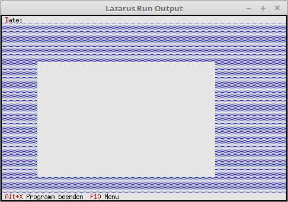

# 14 - TView
## 00 - Simplest TView



**TView** is the lowest level of all windows, dialogs, buttons, etc.
For this reason I made this small example of **TView**.
No changes are possible on this view, as no events or control elements are available yet.

---
In the constructor the view is created.

```pascal
  constructor TMyApp.Init;
  begin
    inherited Init;   // Call ancestor.
    NewView;          // Create view.
  end;
```

A simple view is created, as expected you don't see much, except a gray rectangle.

```pascal
  procedure TMyApp.NewView;
  var
    Win: PView;
    R: TRect;
  begin
    R.Assign(10, 5, 60, 20);
    Win := New(PView, Init(R));

    if ValidView(Win) <> nil then begin
      Desktop^.Insert(Win);
    end;
  end;
```
