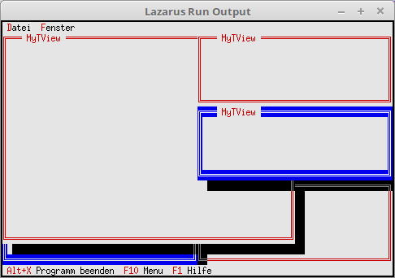

# 14 - TView
## 05 - Extend TView



**TView** is the lowest level of all windows, dialogs, buttons, etc.
For this reason I made this small example of **TView**.

---
A counter has been added when creating the window.
If you want an overlapping or side-by-side display for the windows, you have to set the status **ofTileable**.

```pascal
  procedure TMyApp.NewWindows;
  var
    Win: PMyView;
    R: TRect;
  const
    WinCounter: integer = 0;                    // Counts windows
  begin
    R.Assign(0, 0, 60, 20);
    Inc(WinCounter);
    Win := New(PMyView, Init(R));
    Win^.Options := Win^.Options or ofTileable; // For Tile and Cascade

    if ValidView(Win) <> nil then begin
      Desktop^.Insert(Win);
    end else begin
      Dec(WinCounter);
    end;
  end;
```

Since there is no **cmClose** processing in the view, it is manually checked in a loop whether there are windows, if yes, delete them.

```pascal
procedure TMyApp.CloseAll;
var
  v: PView;
begin
  v := Desktop^.Current;   // Are there windows?
  while v <> nil do begin
    Desktop^.Delete(v);    // Delete window.
    v := Desktop^.Current;
  end;
end;
```

**cmNewWin** must be processed yourself. **cmClose** for closing the window runs automatically in the background.

```pascal
  procedure TMyApp.HandleEvent(var Event: TEvent);
  begin
    inherited HandleEvent(Event);

    if Event.What = evCommand then begin
      case Event.Command of
        cmNewWin: begin
          NewWindows;    // Create window.
        end;
        cmRefresh: begin
          ReDraw;        // Redraw application.
        end;
        cmCloseAll: begin
          CloseAll;
        end;
        cmClose: begin
          if Desktop^.Current <> nil then  Desktop^.Delete(Desktop^.Current);
        end;
        else begin
          Exit;
        end;
      end;
    end;
    ClearEvent(Event);
  end;
```


---
**Unit with the new dialog.**
<br>
With the 3 upper buttons, you can change the color scheme of the dialog.

```pascal
unit MyView;

```

Here 3 event constants have been added.

```pascal
type
  PMyView = ^TMyView;

  { TMyView }

  TMyView = object(TView)
    MyCol:Byte;
    constructor Init(var Bounds: TRect);
    destructor Done; Virtual;

    procedure Draw; virtual;
    procedure HandleEvent(var Event: TEvent); Virtual;
  end;

```

Building the dialog is nothing special.

```pascal
procedure TMyView.Draw;
const
  Titel = 'MyTView';
var
  B: TDrawBuffer;
  y: integer;
begin
  inherited Draw;

  EnableCommands([cmClose]);

  WriteChar(0, 0, #201, MyCol, 1);
  WriteChar(1, 0, #205, MyCol, 3);
  WriteStr(5, 0, Titel, 4);
  WriteChar(Length(Titel) + 6, 0, #205, MyCol, Size.X - Length(Titel) - 7);
  WriteChar(Size.X - 1, 0, #187, MyCol, 1);

  for y := 1 to Size.Y - 2 do begin
    WriteChar(0, y, #186, MyCol, 1);
    WriteChar(Size.X - 1, y, #186, MyCol, 1);
  end;

  WriteChar(0, Size.Y - 1, #200, MyCol, 1);
  WriteChar(1, Size.Y - 1, #205, MyCol, Size.X - 2);
  WriteChar(Size.X - 1, Size.Y - 1, #188, MyCol, 1);
end;

```

Here the color schemes are changed with the help of **Palette := dpxxx**.
It is also important here to call **Draw**, this time not for a component, but for the whole dialog.

```pascal
procedure TMyView.HandleEvent(var Event: TEvent);
begin
  inherited HandleEvent(Event);

  case Event.What of
    evMouseDown: begin    // Mouse button was pressed.
      MyCol:=Random(16);
      Draw;
    end;
  end;
end;

```
