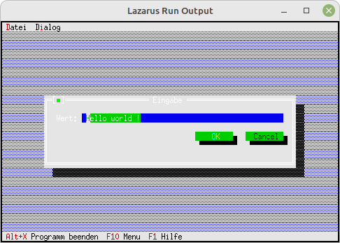

# 15 - Ready-made Dialogs
## 15 - String Input Box



There is also a ready-made dialog for a string input.
There is also **InputBoxRect**, where you can set the size of the box yourself.

---
This is what the code for the string input looks like.

```pascal
  procedure TMyApp.HandleEvent(var Event: TEvent);
  var
    s:ShortString;
  begin
    inherited HandleEvent(Event);

    if Event.What = evCommand then begin
      case Event.Command of
        cmInputLine: begin
          s := 'Hello world !';
          // The InputBox
          if InputBox('Eingabe', 'Wert:', s, 255) = cmOK then begin
            MessageBox('Es wurde "' + s + '" eingegeben', nil, mfOKButton);
          end;
        end;
        else begin
          Exit;
        end;
```
