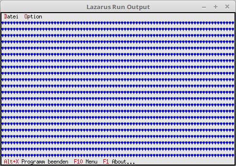

# 19 - Visual Design
## 00 --Desktop Background Characters



For the desktop background you can assign any background character. The default is character **#176**.

---
You add the background similar to a window/dialog, this is also done with **Insert**.
With **#3** it fills the background with hearts.

```pascal
  constructor TMyApp.Init;
  var
    R: TRect;
  begin
    inherited Init;                                      // Call ancestor
    GetExtent(R);

    DeskTop^.Insert(New(PBackGround, Init(R, #3)));   // Insert background.
  end;
```
