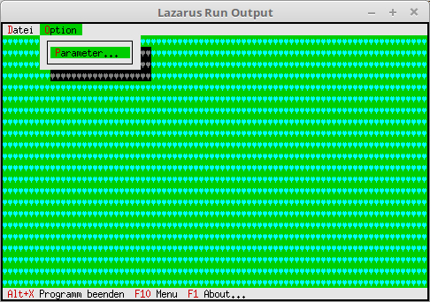

# 19 - Visual Design
## 05 --Desktop Background Color



If you want to change the color of the background, it is a bit more complicated than just the character.
For this you have to override the **GetPalette** function in the **TBackground** object.


---
A descendant is created for the **TBackground** object, which gets a new **GetPalette** function.

```pascal
type
  PMyBackground = ^TMyBackground;
  TMyBackground = object(TBackGround)
    function GetPalette: PPalette; virtual; // new GetPalette
  end;
```

In the new function a different palette is assigned.

```pascal
  function TMyBackground.GetPalette: PPalette;
  const
    P: string[1] = #74;
  begin
    Result := @P;
  end;
```

The constructor looks almost the same as with the background character.
The only difference is that instead of **PBackGround**, **PMyBackground** is used.

```pascal
  constructor TMyApp.Init;
  var
    R:TRect;
  begin
    inherited Init;                                       // Call ancestor
    GetExtent(R);

    DeskTop^.Insert(New(PMyBackground, Init(R, #3)));  // Insert background.
  end;
```
