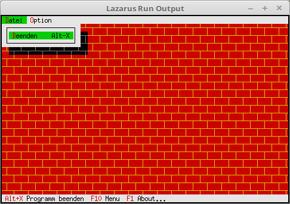

# 19 - Visual Design
## 10 --Custom Desktop Background



You even have the possibility to draw the whole background yourself.
Since you draw everything yourself, you can save the detour via **TBackGround** and inherit directly from **TView**.
**TBackGround** is a direct descendant of **TView**.

---
A descendant is created for the **TView** object, which gets a new **Draw** procedure.

```pascal
type
  PMyBackground = ^TMyBackground;
  TMyBackground = object(TView)
    procedure Draw; virtual; // new Draw procedure.
  end;
```

In the new function, a byte pattern in the form of a brick wall is drawn.
The possibilities are unlimited, you can create a whole image.
What you want to output goes line by line into the **TDrawBuffer**.
Then the buffer is drawn with **WriteLine(...**.

```pascal
  procedure TMyBackground.Draw;
  const
    b1 : array [0..3] of Byte = (196, 193, 196, 194); // upper brick row.
    b2 : array [0..3] of Byte = (196, 194, 196, 193); // lower brick row.

  var
    Buf1, Buf2: TDrawBuffer;
    i: integer;
  begin
    for i := 0 to Size.X - 1 do begin
      Buf1[i] := b1[i mod 4] + $46 shl 8;
      Buf2[i] := b2[i mod 4] + $46 shl 8;
    end;

    for i := 0 to Size.Y div 2 do begin
      WriteLine(0, i * 2 + 0, Size.X, 1, Buf1);
      WriteLine(0, i * 2 + 1, Size.X, 1, Buf2);
    end;
  end;
```

The constructor looks the same as with the background character color.
It doesn't matter whether **TMyBackground** is a descendant of **TView** or **TBackground**.

```pascal
  constructor TMyApp.Init;
  var
    R: TRect;
  begin
    inherited Init;                                // Call ancestor
    GetExtent(R);

    DeskTop^.Insert(New(PMyBackground, Init(R)));  // Insert background.
  end;
```
