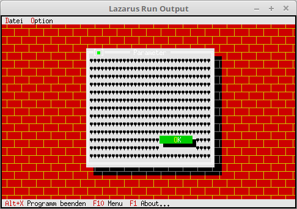

# 19 - Visual Design
## 15 --Background on Dialog



If needed, you can also put a background pattern on a dialog/window.

---
Here the **PBackGround** is placed on a dialog, this works exactly the same as on the desktop.
This can also be the custom **PMyBackground**.
**Important** is, the Background **MUST** be inserted into the dialog first,
otherwise it will overwhelm the other components.

```pascal
  procedure TMyApp.MyOption;
  var
    Dlg: PDialog;
    R: TRect;
  begin
    R.Assign(0, 0, 35, 15);
    R.Move(23, 3);
    Dlg := New(PDialog, Init(R, 'Parameter'));

    with Dlg^ do begin

      // BackGround --> Always first
      GetExtent(R);
      R.Grow(-1, -1);
      Insert(New(PBackGround, Init(R, #3)));  // Insert background.

      // Ok-Button
      R.Assign(20, 11, 30, 13);
      Insert(new(PButton, Init(R, '~O~K', cmOK, bfDefault)));
    end;

    if ValidView(Dlg) <> nil then begin
      Desktop^.ExecView(Dlg);
      Dispose(Dlg, Done);
    end;
  end;
```
