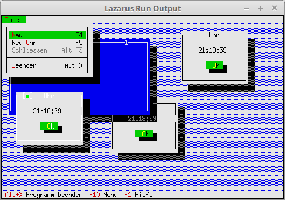

# 20 - Miscellaneous
## 00 - Idle Handle a Clock



Here it is shown how to use **Idle**.
This idle time is used to update a clock in dialogs.
The object with the clock dialog is located in the **UhrDialog** unit.

---
New constant for the command new clock dialog.

```pascal
const
  cmNewWin = 1001;
  cmNewUhr = 1002;
```

Here is the most important method **Idle**.
This method is called when the CPU has nothing else to do.
Here it is used to update the clock time in the dialogs.

```pascal
type
  TMyApp = object(TApplication)
    zeitalt: Integer;
    constructor Init;

    procedure InitStatusLine; virtual;
    procedure InitMenuBar; virtual;

    procedure HandleEvent(var Event: TEvent); virtual;

    procedure NewWindows;
    procedure NewUhr;

    procedure Idle; Virtual;  // The most important.
  end;
```

At the beginning a window and a clock dialog are created.

```pascal
constructor TMyApp.Init;
begin
  inherited Init;   // Call ancestor.
  NewWindows;       // Create window.
  NewUhr;           // Create clock dialog.
end;
```

Insert new clock dialog into the desktop.

```pascal
procedure TMyApp.NewUhr;
begin
  Desktop^.Insert(ValidView(New(PUhrView, Init)));
end;
```

The idle process **Idle**.
With **Message(...** all windows and dialogs are given the **cmUhrRefresh** command.
The **evBroadcast** event is also used for this, as it is a transmission.
Only the clock dialog reacts to this command, because it is intercepted there.
With the window it simply passes through.
You can also clearly see that the Message is only called when a second has passed.
As the last parameter, a pointer to a string is passed, which contains the current time.
If you did it on every Idle, the clock would only flicker.

```pascal
procedure TMyApp.Idle;
var
  zeitNeu: Integer;
  s: ShortString;      // Stores the current time as a string.
begin
  zeitNeu := round(time * 60 * 60 * 24);           // Calculate seconds.
  if zeitNeu <> zeitalt then begin                 // Only update when a second has passed.
    zeitalt := zeitNeu;
    s:= TimeToStr(Now);                            // Current time as string.
    Message(@Self, evBroadcast, cmUhrRefresh, @s); // Call own HandleEvent.
  end;
end;
```

This HandleEvent is not interested in the **cmUhrRefresh** command.

```pascal
procedure TMyApp.HandleEvent(var Event: TEvent);
begin
  inherited HandleEvent(Event);

  if Event.What = evCommand then begin
    case Event.Command of
      cmNewWin: begin
        NewWindows;    // Create window.
      end;
      cmNewUhr: begin
        NewUhr;        // Create clock dialog.
      end;
      else begin
        Exit;
      end;
    end;
  end;
  ClearEvent(Event);
end;
```


---
**Unit with the clock dialog.**
<br>
The components on the dialog are nothing special, it only has an OK button.
The time is written directly with **WriteLine(...**.
For this reason the **Draw** method was added.

```pascal
unit UhrDialog;

```

The declaration of the dialog.
Here the time is stored in **ZeitStr**, so that it can be output with **Draw**.

```pascal
const
  cmUhrRefresh = 1003;

type
  PUhrView = ^TUhrView;
  TUhrView = object(TDialog)
  private
    ZeitStr: ShortString;
  public
    constructor Init;
    procedure Draw; Virtual;
    procedure HandleEvent(var Event: TEvent); virtual;
  end;

```

In the dialog only an OK button is created.

```pascal
constructor TUhrView.Init;
var
  R: TRect;
begin
  R.Assign(51, 1, 70, 8);
  inherited Init(R, 'Uhr');

  R.Assign(7, 4, 13, 6);
  Insert(new(PButton, Init(R, '~O~k', cmOK, bfDefault)));
end;

```

In **Draw** you can clearly see that the time is written directly into the dialog.

```pascal
procedure TUhrView.Draw;
var
  b: TDrawBuffer;
  c: Byte;
begin
  inherited Draw;
  c := GetColor(7);
  MoveChar(b, ' ', c, Size.X + 4);
  MoveStr(b, ZeitStr, c);
  WriteLine(5, 2, Size.X + 2, 1, b);
end;

```

The **HandleEvent** is more interesting, there the **evBroadcast** event and
the **cmUhrRefresh** command are intercepted, which was passed in the main program with Message.
The string containing the time is also taken over from **Event.InfoPtr**.
The **cmOk** command is nothing special, it only closes the dialog.

```pascal
procedure TUhrView.HandleEvent(var Event: TEvent);
begin
  inherited HandleEvent(Event);

  case Event.What of
    evBroadcast: begin
      case Event.Command of
        cmUhrRefresh: begin
          ZeitStr := PString(Event.InfoPtr)^;
          Draw;
        end;
      end;
    end;
    evCommand: begin
      case Event.Command of
        cmOK: begin
          Close;
        end;
      end;
    end;
  end;
end;

```
