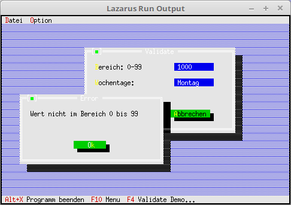

# 20 - Miscellaneous
## 10 - InputLine Validate



Here a range limitation for **PInputLine** is shown.
In the first line only a number between 0 and 99 is allowed.
In the second line it must be a day of the week (Monday - Friday).
For the second case a ListBox would be more ideal, I just want to show how it works with the **PInputLine**.

---

---
**Unit with the new dialog.**
<br>
A dialog with **PInputLine** which gets a validation.
When you press **Ok**, validate checks are performed.
With **Cancel** there is no check.

```pascal
unit MyDialog;

```

The declaration of the dialog, here only the Init is overridden, which creates the components for the dialog.
Incidentally, the two Validates are also overridden.
This is only done so that a German error message comes on wrong input.

```pascal
type
  PMyDialog = ^TMyDialog;
  TMyDialog = object(TDialog)
    constructor Init;
  end;

  PMyRangeValidator = ^TMyRangeValidator;
  TMyRangeValidator = object(TRangeValidator)
    procedure Error; Virtual;   // Overrides the English error message.
  end;

  PMyStringLookUpValidator = ^TMyStringLookUpValidator;
  TMyStringLookUpValidator = object(TStringLookUpValidator)
    procedure Error; Virtual;   // Overrides the English error message.
  end;

```

The two new error messages.

```pascal
procedure TMyRangeValidator.Error;
var
  Params: array[0..1] Of Longint;
begin
  Params[0] := Min;
  Params[1] := Max;
  MessageBox('Wert nicht im Bereich %d bis %d', @Params, mfError or mfOKButton);
end;

procedure TMyStringLookUpValidator.Error;
begin
  MessageBox('Eingabe nicht in g'#129'ltiger Liste', nil, mfError or mfOKButton);
end;

```

Here you can see that a validate check is added to the **PInputLines**.

```pascal
constructor TMyDialog.Init;
const
  // Days of the week, as strings, which are allowed in the PInputLine.
  WochenTag:array[0..6] of String = ('Montag', 'Dienstag', 'Mittwoch', 'Donnerstag', 'Freitag', 'Samstag', 'Sonntag');
var
  R: TRect;
  i: Integer;
  InputLine: PInputLine;               // The input lines.
  StringCollektion: PStringCollection; // String list, which contains the allowed strings.
begin
  // The dialog itself.
  R.Assign(0, 0, 42, 11);
  R.Move(23, 3);
  inherited Init(R, 'Validate');

  // --- InputLine with range limitation 0-99.
  R.Assign(25, 2, 36, 3);
  InputLine := new(PInputLine, Init(R, 6));
  // Validate check 0-99.
  InputLine^.SetValidator(new(PMyRangeValidator, Init(0, 99)));
  Insert(InputLine);
  R.Assign(2, 2, 22, 3);
  Insert(New(PLabel, Init(R, '~R~ange: 0-99', InputLine)));

  // --- Days of the week
  // Create string list.
  StringCollektion := new(PStringCollection, Init(10, 2));
  // Load string list with the days of the week.
  for i := 0 to 6 do begin
    StringCollektion^.Insert(NewStr(WochenTag[i]));
  end;
  R.Assign(25, 4, 36, 5);
  InputLine := new(PInputLine, Init(R, 10));
  // Check with the string list.
  InputLine^.SetValidator(new(PMyStringLookUpValidator, Init(StringCollektion)));
  Insert(InputLine);
  R.Assign(2, 4, 22, 5);
  Insert(New(PLabel, Init(R, '~D~ays of week:', InputLine)));

  // ---Ok-Button
  R.Assign(7, 8, 19, 10);
  Insert(new(PButton, Init(R, '~O~K', cmOK, bfDefault)));

  // --- Cancel-Button
  R.Assign(24, 8, 36, 10);
  Insert(new(PButton, Init(R, '~C~ancel', cmCancel, bfNormal)));
end;

```
