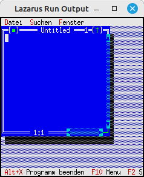

# 20 - Miscellaneous
## 20 - Intercept Terminal Resize (Linux only)



It is also possible to react to a resize event from the terminal.
This example only works with **Linux**.
Due to technical limitations of Free-Vision, it ends at **255** characters per line.

Attention!
This is a custom creation, so it may have bugs.
Conflicts can occur when the resize event is called
while another output is running.

---

```pascal
uses
  BaseUnix, // For resize signal and resolution
```

This must be inserted to react to a resize event

```pascal

const
  STDIN_FILENO = 0;   // Standard input
  STDOUT_FILENO = 1;  // Standard output
  STDERR_FILENO = 2;  // Standard error output

  TIOCGWINSZ = $5413;
  SIGWINCH = 28;      // Window size change

  procedure resize(signal: longint); cdecl;
  var
    w: record
      ws_row, ws_col, ws_xpixel, ws_ypixel: cshort;
    end;
    vm: TVideoMode;
  begin
    FpIOCtl(STDOUT_FILENO, TIOCGWINSZ, @w);  // Query current resolution.
    if w.ws_col > 255 then begin  // Check if more than 255 characters per column,
      w.ws_col := 255;            // If yes, limit to 255 characters.
    end;                          // More than 255 characters is technically not possible with FV!

    vm.Col := w.ws_col;
    vm.Row := w.ws_row;
    MyApp.SetScreenVideoMode(vm); // Pass new coordinates to FV.

    MyApp.ReDraw;                 // Redraw desktop.
  end;

begin
  MyApp.Init;

  FpSignal(SIGWINCH, @resize); // Intercept resize

  MyApp.Run;
  MyApp.Done;
end.
```
