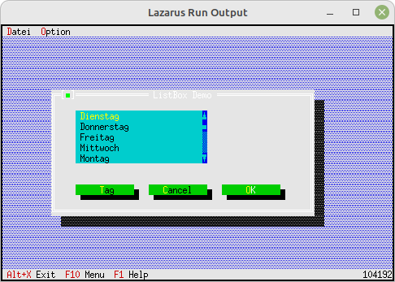

# 30 - Gadgets
## 00 - Display RAM Usage (Heap)



In this example a small gadget is loaded which displays the used **Heap**.
This function makes sense if you want to see if you have a memory leak.
The **TListBox** is a good example, as it does not clean up the list itself.
The **destructor** which cleans up the memory is missing there. This also makes sense, since you can also use lists globally.

---
    Creates a small window bottom-right, which displays the heap.

```pascal
    GetExtent(R);
    R.A.X := R.B.X - 12;
    R.A.Y := R.B.Y - 1;
    Heap := New(PHeapView, Init(R));
    Insert(Heap);
```

Call the dialog with the memory leak.

```pascal
  procedure TMyApp.HandleEvent(var Event: TEvent);
  var
    MyDialog: PMyDialog;
    FileDialog: PFileDialog;
    FileName: ShortString;
  begin
    inherited HandleEvent(Event);

    if Event.What = evCommand then begin
      case Event.Command of
        // Dialog with the ListBox, which has a memory leak.
        cmDialog: begin
          MyDialog := New(PMyDialog, Init);
          if ValidView(MyDialog) <> nil then begin
            Desktop^.ExecView(MyDialog);   // Execute dialog.
            Dispose(MyDialog, Done);       // Free dialog and memory.
          end;
        end;
        // A FileOpenDialog, where everything is OK.
        cmFileTest:begin
          FileName := '*.*';
          New(FileDialog, Init(FileName, 'Datei '#148'ffnen', '~D~ateiname', fdOpenButton, 1));
          if ExecuteDialog(FileDialog, @FileName) <> cmCancel then begin
            NewWindows(FileName); // New window with the selected file.
          end;
        end
        else begin
          Exit;
        end;
      end;
    end;
    ClearEvent(Event);
  end;
```

The idle routine, which checks and displays the heap in idle time.

```pascal
  procedure TMyApp.Idle;

    function IsTileable(P: PView): Boolean;
    begin
      Result := (P^.Options and ofTileable <> 0) and (P^.State and sfVisible <> 0);
    end;

  begin
    inherited Idle;
    Heap^.Update;
    if Desktop^.FirstThat(@IsTileable) <> nil then begin
      EnableCommands([cmTile, cmCascade])
    end else begin
      DisableCommands([cmTile, cmCascade]);
    end;
  end;
```


---
**Unit with the new dialog.**
<br>
The dialog with the memory leak

```pascal
unit MyDialog;

```

Declare the **destructor** which fixes the **memory leak**.

```pascal
type
  PMyDialog = ^TMyDialog;
  TMyDialog = object(TDialog)
  const
    cmTag = 1000;  // Local event constant
  var
    ListBox: PListBox;
    StringCollection: PStringCollection;

    constructor Init;
    destructor Done; virtual;  // Because of memory leak
    procedure HandleEvent(var Event: TEvent); virtual;
  end;

```

Generate components for the dialog.

```pascal
constructor TMyDialog.Init;
var
  R: TRect;
  ScrollBar: PScrollBar;
  i: Sw_Integer;
const
  Tage: array [0..6] of shortstring = (
    'Montag', 'Dienstag', 'Mittwoch', 'Donnerstag', 'Freitag', 'Samstag', 'Sonntag');

begin
  R.Assign(10, 5, 64, 17);
  inherited Init(R, 'ListBox Demo');

  // StringCollection
  StringCollection := new(PStringCollection, Init(5, 5));
  for i := 0 to Length(Tage) - 1 do begin
    StringCollection^.Insert(NewStr(Tage[i]));
  end;

  // ScrollBar for ListBox
  R.Assign(31, 2, 32, 7);
  ScrollBar := new(PScrollBar, Init(R));
  Insert(ScrollBar);

  // ListBox
  R.Assign(5, 2, 31, 7);
  ListBox := new(PListBox, Init(R, 1, ScrollBar));
  ListBox^.NewList(StringCollection);
  Insert(ListBox);

  // Day-Button
  R.Assign(5, 9, 18, 11);
  Insert(new(PButton, Init(R, '~T~ag', cmTag, bfNormal)));

  // Cancel-Button
  R.Move(15, 0);
  Insert(new(PButton, Init(R, '~C~ancel', cmCancel, bfNormal)));

  // Ok-Button
  R.Move(15, 0);
  Insert(new(PButton, Init(R, '~O~K', cmOK, bfDefault)));
end;

```

Manually free the memory.
You can try commenting out the Dispose here, then you can see
that you get a memory leak.

```pascal
destructor TMyDialog.Done;
begin
   Dispose(ListBox^.List, Done); // Try commenting this out
   inherited Done;
end;

```

The event handler

```pascal
procedure TMyDialog.HandleEvent(var Event: TEvent);
var
  s: ShortString;
begin
  case Event.What of
    evCommand: begin
      case Event.Command of
        cmOK: begin
          // do something
        end;
        cmTag: begin
          str(ListBox^.Focused + 1, s);
          MessageBox('Wochentag: ' + s + ' selected', nil, mfOKButton);
          ClearEvent(Event);  // End event.
        end;
      end;
    end;
  end;
  inherited HandleEvent(Event);
end;

```
