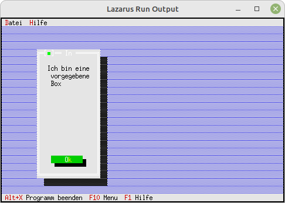

# 90 - Experiments
## 20 - Simple MessageBox with Dlg



With the MessageBox, you can also set the size manually.
For this you have to use **MessageBoxRect(...)**.

---
Here the size of the box is set manually with **R.Assign**.

```pascal
  procedure TMyApp.HandleEvent(var Event: TEvent);
  var
    R: TRect;
    Dlg: PDialog;
  begin
    inherited HandleEvent(Event);

    if Event.What = evCommand then begin
      case Event.Command of
        cmAbout: begin
          R.Assign(12, 3, 58, 20);  // Size of the box
          Dlg := New(PDialog, Init(R, 'Parameter'));
          with Dlg^ do begin

            // CheckBoxes
            R.Assign(4, 3, 18, 7);
            Insert(New(PCheckBoxes, Init(R, NewSItem('~D~atei', NewSItem('~Z~eile',
              NewSItem('D~a~tum', NewSItem('~Z~eit', nil)))))));

            // BackGround
            GetExtent(R);
            R.Grow(-1, -1);
//            Insert(New(PBackGround, Init(R, #3)));  // Insert background.

            // My-Button
            R.Assign(7, 12, 17, 14);
            Insert(new(PButton, Init(R, '~M~yButton', cmMyBotton, bfDefault)));

          end;


          R.Assign(22, 3, 42, 10);  // Size of the box
          MessageBoxRectDlg(Dlg, R, 'Ich bin eine vorgegebene Box', nil, mfInformation + mfYesButton + mfNoButton);
          Dispose(Dlg, Done);
        end;
        cmMyBotton: begin
          MessageBox('Eigen Button gedrückt', nil, mfInformation);

        end


        else begin
          Exit;
        end;
```
