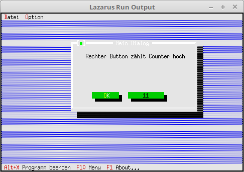

# 99 - Test
## 00 - Modify Components at Runtime



In inherited dialogs it is possible to install buttons that perform an action locally in the dialog.
In the example, a MessageBox is called.

---

---
**Unit with the new dialog.**
<br>
There it is shown how to read and write values in components at runtime.
As an example, the number in the button is increased by 1 on each press.

```pascal
unit MyDialog;

```

If you want to modify a component at runtime, you have to declare it, otherwise you can no longer access it.
Directly with **Insert(New(...** no longer works.

```pascal
type
  PMyDialog = ^TMyDialog;
  TMyDialog = object(TDialog)
  const
    cmCounter = 1003;       // Used locally for the counter button.
  var
    CounterButton: PButton; // Button with counter.

    constructor Init;
    procedure HandleEvent(var Event: TEvent); virtual;
  end;

```

In the constructor you can see that you take the detour via **CounterButton**.
**CounterButton** is needed for the modification.

```pascal
constructor TMyDialog.Init;
var
  Rect: TRect;
begin
  Rect.Assign(0, 0, 42, 11);
  Rect.Move(23, 3);
  inherited Init(Rect, 'Mein Dialog');

  // StaticText
  Rect.Assign(5, 2, 41, 8);
  Insert(new(PStaticText, Init(Rect, 'Right button counts counter up')));

  // Button where the title is changed.
  Rect.Assign(19, 8, 32, 10);
  CounterButton := new(PButton, Init(Rect, '0', cmCounter, bfNormal));
  Insert(CounterButton);

  // Ok-Button
  Rect.Assign(7, 8, 17, 10);
  Insert(new(PButton, Init(Rect, '~O~K', cmOK, bfDefault)));
end;

```

In the event handler, the number in the button is increased when pressed.
This shows why you need the **CounterButton**, without it you would have no access to **Title**.
Important, when you change a component, you have to redraw the component with **Draw**, otherwise you won't see the changed value.

```pascal
procedure TMyDialog.HandleEvent(var Event: TEvent);
var
  Counter: integer;
begin
  inherited HandleEvent(Event);

  case Event.What of
    evCommand: begin
      case Event.Command of
        cmCounter: begin
          Counter := StrToInt(CounterButton^.Title^); // Read button title.
          Inc(Counter);                               // Increase counter.
          CounterButton^.Title^ := IntToStr(Counter); // Pass new title to button.

          CounterButton^.Draw;                        // Redraw button.
          ClearEvent(Event);                          // End event.
        end;
        cmOK:Close;
      end;
    end;
  end;

end;

```
