# FPC FreeVision
## Introduction
Note: The sources on GitHub are more up-to-date than the Wiki. 
There are also examples on GitHub that are not documented in the Wiki. 
## Tutorial
* [Introduction](#introduction)
* [Status Line and Menu](#status-line-and-menu)
* [Dialogs](#dialogs)
* [Dialogs as Components](#dialogs-as-components)
* [Lists and ListBoxes](#lists-and-listboxes)
* [EventHandle outside Components](#eventhandle-outside-components)
* [Modify Components](#modifying-components)
* [Windows](#windows)
* [Editor](#editor)
* [TView](#tview)
* [Ready-made Dialogs](#ready-made-dialogs)
* [Visual Design](#visual-design)
* [Miscellaneous](#miscellaneous)
* [Gadgets](#gadgets)
* [Experiments](#experiments)
* [Test](#test)
 [testlink](#radiobutton)
### Introduction
| Link | Description
| :---: | ---
| [Introduction](01_-_Introduction/00_-_Introduction/readme.md) | 
| [First Desktop](01_-_Introduction/05_-_First_Desktop/readme.md) | 
| [Hello World](01_-_Introduction/10_-_Hello_World/readme.md) | 
### Status Line and Menu
| Link | Description
| :---: | ---
| [Status Line](02_-_Status_Line_and_Menu/00_-_Status_Line/readme.md) | 
| [Status Line Multiple Entries](02_-_Status_Line_and_Menu/05_-_Status_Line_Multiple_Entries/readme.md) | 
| [Menu](02_-_Status_Line_and_Menu/10_-_Menu/readme.md) | 
| [Menu Extended](02_-_Status_Line_and_Menu/15_-_Menu_Extended/readme.md) | 
| [Menu Nested](02_-_Status_Line_and_Menu/20_-_Menu_Nested/readme.md) | 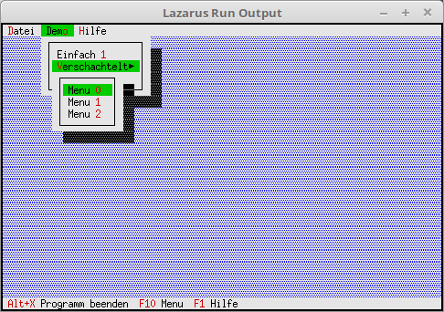
| [Ready-made Status Line and Menus](02_-_Status_Line_and_Menu/25_-_Ready-made_Status_Line_and_Menus/readme.md) | 
| [Menu Hints](02_-_Status_Line_and_Menu/30_-_Menu_Hints/readme.md) | 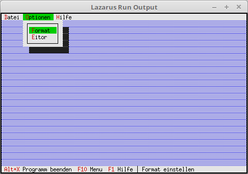
| [Swap Menu and Status Line](02_-_Status_Line_and_Menu/35_-_Swap_Menu_and_Status_Line/readme.md) | 
### Dialogs
| Link | Description
| :---: | ---
| [Process Events](03_-_Dialogs/00_-_Process_Events/readme.md) | 
| [First Dialog](03_-_Dialogs/05_-_First_Dialog/readme.md) | 
| [Button](03_-_Dialogs/10_-_Button/readme.md) | 
| [Check Boxes](03_-_Dialogs/15_-_Check_Boxes/readme.md) | 
| [RadioButtons](03_-_Dialogs/20_-_RadioButton/readme.md) | 
| [Label for Check and Radio-Group](03_-_Dialogs/25_-_Label_for_Check_and_Radio_Group/readme.md) | 
| [InputLine (Edit Line)](03_-_Dialogs/30_-_InputLine_(Edit_Line)/readme.md) | 
| [Remember Values in Dialog](03_-_Dialogs/35_-_Remember_Values_in_Dialog/readme.md) | 
| [Check Free Memory](03_-_Dialogs/40_-_Check_Free_Memory/readme.md) | 
| [Save Dialog Values to Disk](03_-_Dialogs/45_-_Save_Dialog_Values_to_Disk/readme.md) | 
| [StaticText Good for an About](03_-_Dialogs/50_-_StaticText_Good_for_About/readme.md) | 
### Dialogs as Components
| Link | Description
| :---: | ---
| [A Simple About](04_-_Dialogs_as_Components/00_-_Simple_About/readme.md) | 
| [Dialog with Local Event](04_-_Dialogs_as_Components/05_-_Dialog_with_Local_Event/readme.md) | 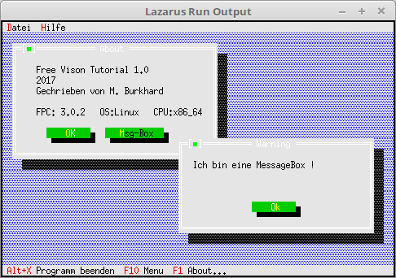
| [Modify Components at Runtime](04_-_Dialogs_as_Components/10_-_Modify_Components_at_Runtime/readme.md) | 
| [Different Dialog Colors](04_-_Dialogs_as_Components/15_-_Different_Dialog_Colors/readme.md) | 
| [Pass Event to Dialog](04_-_Dialogs_as_Components/20_-_Pass_Event_to_Dialog/readme.md) | 
### Lists and ListBoxes
| Link | Description
| :---: | ---
| [StringCollection Unsorted](06_-_Lists_and_ListBoxes/00_-_StringCollection_Unsorted/readme.md) | 
| [StringCollection Sorted](06_-_Lists_and_ListBoxes/05_-_StringCollection_Sorted/readme.md) | 
| [ListBox Unsorted](06_-_Lists_and_ListBoxes/10_-_ListBox_Unsorted/readme.md) | 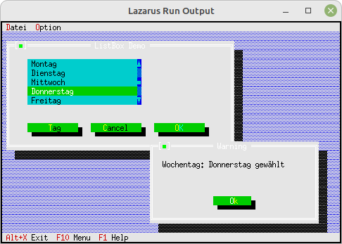
| [ListBox Sorted](06_-_Lists_and_ListBoxes/15_-_ListBox_Sorted/readme.md) | 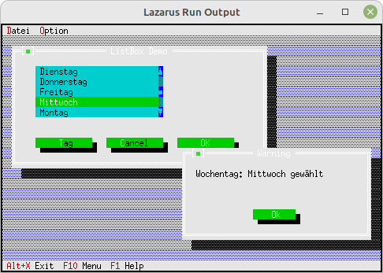
| [ListBox Multiple Columns](06_-_Lists_and_ListBoxes/20_-_ListBox_Multiple_Columns/readme.md) | 
| [ListBox Insert and Remove Entries](06_-_Lists_and_ListBoxes/25_-_ListBox_Insert_and_Remove_Entries/readme.md) | 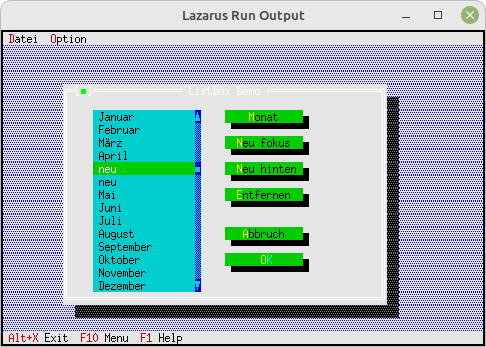
| [ListBox Double-Click](06_-_Lists_and_ListBoxes/30_-_ListBox_Double_Click/readme.md) | 
### EventHandle outside Components
| Link | Description
| :---: | ---
| [Mouse Event](08_-_EventHandle_outside_Components/00_-_Mouse_Event/readme.md) | 
| [Keyboard Event](08_-_EventHandle_outside_Components/05_-_Keyboard_Event/readme.md) | 
### Modify Components
| Link | Description
| :---: | ---
| [Modify Button](10_-_Modifying_Components/00_-_Modify_Button/readme.md) | 
### Windows
| Link | Description
| :---: | ---
| [First Window](11_-_Windows/00_-_First_Window/readme.md) | 
| [Create and Close Window](11_-_Windows/05_-_Create_and_Close_Window/readme.md) | 
| [Manage Windows](11_-_Windows/10_-_Manage_Windows/readme.md) | 
| [Equip Window with Controls](11_-_Windows/15_-_Equip_Window_with_Controls/readme.md) | 
### Editor
| Link | Description
| :---: | ---
| [Simple Editor Window](12_-_Editor/00_-_Simple_Editor_Window/readme.md) | 
| [Save and Open](12_-_Editor/05_-_Save_and_Open/readme.md) | 
| [Find Replace](12_-_Editor/10_-_Find_and_Replace/readme.md) | 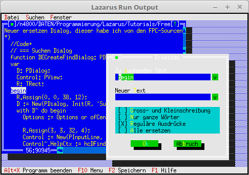
| [Clipboard](12_-_Editor/15_-_Clipboard/readme.md) | 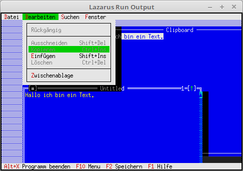
### TView
| Link | Description
| :---: | ---
| [Simplest TView](14_-_TView/00_-_Simplest_TView/readme.md) | 
| [Extend TView](14_-_TView/05_-_Extend_TView/readme.md) | 
### Ready-made Dialogs
| Link | Description
| :---: | ---
| [Simple MessageBox](15_-_Ready-made_Dialogs/00_-_Simple_MessageBox/readme.md) | 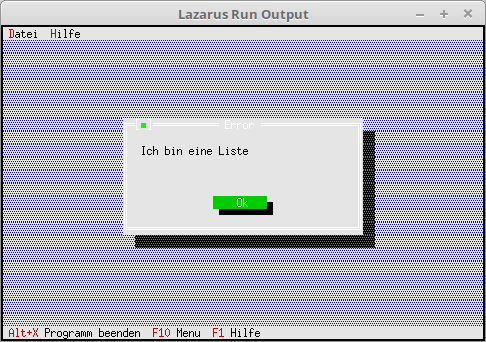
| [Simple MessageBox with Evaluation](15_-_Ready-made_Dialogs/05_-_Simple_MessageBox_with_Evaluation/readme.md) | 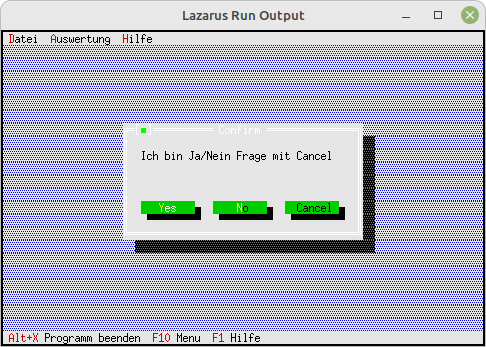
| [Simple MessageBox with Preset Rect](15_-_Ready-made_Dialogs/10_-_Simple_MessageBox_with_Preset_Rect/readme.md) | 
| [String Input Box](15_-_Ready-made_Dialogs/15_-_String_Input_Box/readme.md) | 
| [File Dialogs](15_-_Ready-made_Dialogs/20_-_File_Dialogs/readme.md) | 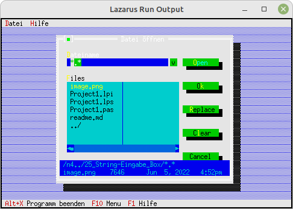
| [Change Folder](15_-_Ready-made_Dialogs/25_-_Change_Folder/readme.md) | 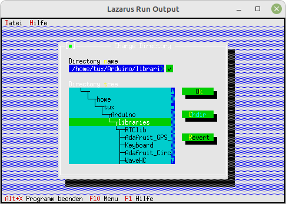
### Visual Design
| Link | Description
| :---: | ---
| [Desktop Background Characters](19_-_Visual_Design/00_-_Desktop_Background_Characters/readme.md) | 
| [Desktop Background Color](19_-_Visual_Design/05_-_Desktop_Background_Color/readme.md) | 
| [Custom Desktop Background](19_-_Visual_Design/10_-_Custom_Desktop_Background/readme.md) | 
| [Background on Dialog](19_-_Visual_Design/15_-_Background_on_Dialog/readme.md) | 
### Miscellaneous
| Link | Description
| :---: | ---
| [Idle Handler Clock](20_-_Miscellaneous/00_-_Idle_Handler_Clock/readme.md) | 
| [Format String](20_-_Miscellaneous/05_-_Format_String/readme.md) | 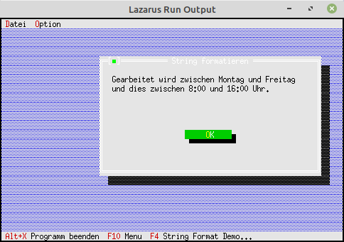
| [InputLine Validate](20_-_Miscellaneous/10_-_InputLine_Validate/readme.md) | 
| [Tree View](20_-_Miscellaneous/15_-_Tree_View/readme.md) | 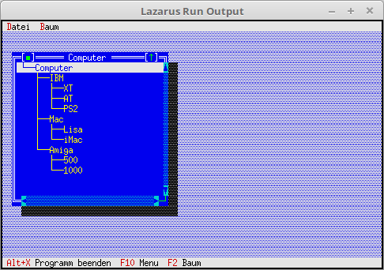
| [Intercept Terminal Resize (Linux only)](20_-_Miscellaneous/20_-_Intercept_Terminal_Resize_(Linux_only)/readme.md) | 
### Gadgets
| Link | Description
| :---: | ---
| [Display RAM Usage (Heap)](30_-_Gadgets/00_-_Display_RAM_Usage_(Heap)/readme.md) | 
| [A Clock](30_-_Gadgets/05_-_A_Clock/readme.md) | 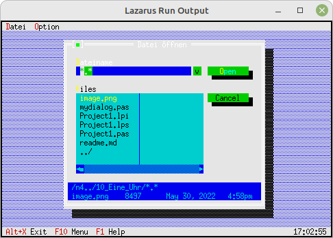
### Experiments
| Link | Description
| :---: | ---
| [2 Menus](90_-_Experiments/00_-_2_Menus/readme.md) | 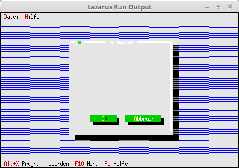
| [Menu Gray Entries](90_-_Experiments/05_-_Menu_Gray_Entries/readme.md) | 
| [2 Desktops](90_-_Experiments/10_-_2_Desktop/readme.md) | 
| [Menu Box](90_-_Experiments/15_-_Menu_Box/readme.md) | 
| [Simple MessageBox with Dlg](90_-_Experiments/20_-_Simple_MessageBox_with_Dlg/readme.md) | 
| [Insert Entry](90_-_Experiments/25_-_Insert_Entry/readme.md) | 
| [EditListBox Unsorted](90_-_Experiments/30_-_EditListBox_Unsorted/readme.md) | 
| [HistoryViewer](90_-_Experiments/35_-_HistoryViewer/readme.md) | 
### Test
| Link | Description
| :---: | ---
| [Modify Components at Runtime](99_-_Test/00_-_Modify_Components_at_Runtime/readme.md) | 
| [TabSheet](99_-_Test/05_-_TabSheet/readme.md) | 
| [ListBox](99_-_Test/10_-_ListBox/readme.md) | 
| [ListBox Heap](99_-_Test/15_-_ListBox_Heap/readme.md) | 
